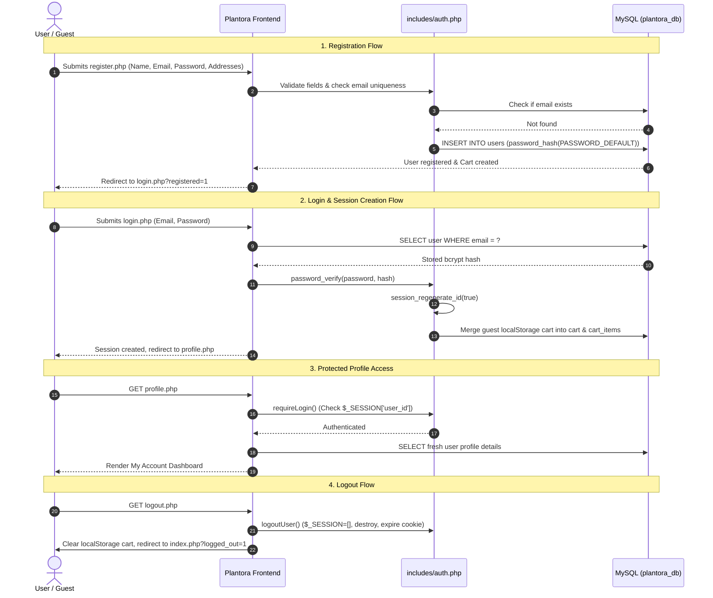

# Plantora – Week 06 Practical Documentation
## User Authentication & Profile Management

**Project Name:** Plantora – Indoor Plant E-Commerce Website  
**Technology Stack:** PHP, MySQL (MariaDB 10.4), HTML5, Custom CSS, Vanilla JavaScript, XAMPP  
**Database:** `plantora_db` (Host: `127.0.0.1`, Port: `3307`, User: `root`, Password: empty)  

---

### 1. Week 06 Objectives
The objective of Week 06 is to build a robust, secure, and production-grade User Authentication & Profile Management subsystem for the Plantora indoor plant e-commerce website. This encompasses:
- Secure Customer Registration with validation and bcrypt password hashing.
- User Login with credentials verification and session regeneration.
- PHP Session Management with route protection for private areas (e.g. My Account profile, checkout).
- Dynamic Navbar UI reflecting authenticated states (`Hi, [Name]`, `Logout`, `My Account`).
- Protected Profile Dashboard (`profile.php` - "My Account") with personal details, contact information, order summaries, and address book.
- Profile Details Editing (`update-profile.php`) and secure Password Change (`update-password.php`).
- Database-backed Cart Association (`plantora_db.cart` & `cart_items`) with automatic guest cart merging upon login.
- Safe SQL Migration preserving existing tables, products, categories, and relationships.

---

### 2. High-Level Authentication Architecture & Flow

```
Registration ➔ Password Hashing ➔ Database (users) ➔ Login ➔ Session (session_regenerate_id) ➔ Protected Profile ➔ Logout
```

#### Architecture Overview


> [!NOTE]
> **Why PHP Sessions instead of JWT?**  
> This project uses native PHP server-side sessions rather than JSON Web Tokens (JWT) because Plantora is hosted and executed on a traditional LAMP/XAMPP server stack where session state is securely maintained in server memory/filesystem and referenced via `HttpOnly` `SameSite=Lax` cookies. This avoids token-storage vulnerabilities (XSS token theft in `localStorage`) and requires no third-party JWT libraries.

---

### 3. Registration Flow (`register.php`)
1. Visitor loads `register.php` (if already logged in, redirected to `profile.php`).
2. Visitor fills in:
   - Full Name
   - Email Address
   - Phone Number
   - Password & Confirm Password
   - Shipping Address
   - Billing Address (with a convenient "Same as Shipping" toggle checkbox).
3. **Server-Side Validation**:
   - `full_name`: Required, string length <= 100.
   - `email`: Required, validated via `filter_var($email, FILTER_VALIDATE_EMAIL)`.
   - `email uniqueness`: Prepared statement query (`SELECT user_id FROM users WHERE email = ? LIMIT 1`).
   - `password`: Minimum 8 characters, requiring both letters and numbers.
   - `confirm_password`: Must match `password` identically.
   - `phone`: Validated with standard phone regex pattern (`/^[0-9+\s\-()]{7,20}$/`).
   - `shipping_address` & `billing_address`: Non-empty text validation.
4. **Password Hashing**:
   - `password_hash($password, PASSWORD_DEFAULT)` generates a 60-character bcrypt hash with an automatic cryptographically secure salt.
5. **Database Insertion**:
   - `INSERT INTO users (name, email, password, phone, address, shipping_address, billing_address, role) VALUES (?, ?, ?, ?, ?, ?, ?, 'customer')`.
   - Role is strictly enforced as `'customer'` (preventing privilege escalation).
6. **Cart Initialization**:
   - Calls `getUserCartId($conn, $newUserId)` to initialize an entry in `plantora_db.cart`.
7. **Success Redirection**:
   - Flash message is queued: `"Registration successful! You can now log in with your credentials."`
   - Redirects to `login.php`.

---

### 4. Login Flow (`login.php`)
1. Visitor submits email and password.
2. Checks for optional `return_url` parameter (sanitized to allow only relative internal application paths, eliminating open redirect vulnerabilities).
3. Prepared statement queries the user:
   ```sql
   SELECT user_id, name, email, password, role FROM users WHERE email = ? LIMIT 1
   ```
4. Verifies submitted password against the stored bcrypt hash:
   ```php
   if ($user && password_verify($password, $user['password'])) { ... }
   ```
5. **On Failure**:
   - Displays generic error message: `"Invalid email or password."`
   - Does not reveal whether the email exists in the database (prevents user enumeration).
6. **On Success**:
   - `loginUser($conn, $user)` is invoked:
     - `session_regenerate_id(true)` replaces the session identifier to prevent session fixation.
     - Sets session variables: `$_SESSION['user_id']`, `$_SESSION['user_name']`, `$_SESSION['user_email']`, `$_SESSION['user_role']`.
     - Ensures user cart exists in `plantora_db.cart`.
   - Any guest items in `localStorage` are automatically submitted and merged into `plantora_db.cart_items`.
   - Redirects to intended destination (`return_url` or `profile.php`).

---

### 5. Logout Flow (`logout.php`)
1. User clicks "Logout" in navbar or profile dashboard.
2. `logout.php` executes `logoutUser()`:
   - `$_SESSION = [];` flushes all session data from memory.
   - `setcookie(session_name(), '', time() - 42000, ...)` destroys the session cookie on the client.
   - `session_destroy()` deletes the session record on the server.
3. Client-side script executes `localStorage.removeItem('plantora_cart')` to ensure User B on the same computer cannot view User A's cart items.
4. Redirects to `index.php?logged_out=1`.
5. Accessing `profile.php` or checking out will immediately redirect to `login.php`.

---

### 6. Session Management (`includes/auth.php`)
The centralized authentication library provides standardized session handlers:
- `startSessionIfNeeded()`: Checks `session_status() === PHP_SESSION_NONE` and configures secure cookie params (`httponly = true`, `samesite = Lax`, 7-day lifetime).
- `isLoggedIn()`: Returns `true` if `$_SESSION['user_id']` is present.
- `currentUserId()`: Returns integer user ID or `null`.
- `currentUser($conn)`: Fetches fresh user record from `users` (omitting passwords and hashes).
- `requireLogin($returnUrl)`: Protects restricted routes. If unauthenticated, redirects to `login.php?return_url=...`.
- `loginUser($conn, $user)`: Safely initializes authenticated session.
- `logoutUser()`: Safely destroys session and cookies.
- `setFlashMessage($type, $message)` & `getFlashMessage()`: Reusable flash messaging.

---

### 7. Password Hashing Method
- Algorithm: **Bcrypt** (`PASSWORD_DEFAULT` in PHP 8.2+).
- Generates a 60-character string starting with `$2y$10$...`.
- Cost parameter: default 10 (1024 iterations with cryptographic salt).
- Verification: `password_verify($password, $hash)` performs constant-time string comparison to prevent timing attacks.
- Plaintext passwords are NEVER logged, displayed, or stored in session or database.

---

### 8. Profile Dashboard Features (`profile.php` - "My Account")
1. **Hero Banner**:
   - User Initial Avatar Circle (`A`, `B`, `D`, etc.).
   - Welcome greeting: `"Hello, [Name]"`.
   - Account Role Badge (`Customer Account`).
   - Meta row: Email address, registration date (`Member since September 15, 2026`), and `Active` status pill.
   - Quick Logout button.
2. **Stat Cards**:
   - Active Items in Cart (queried dynamically from `plantora_db.cart_items`).
   - Total Orders count (queried from `plantora_db.orders`).
   - Saved Addresses count.
3. **Personal & Contact Details Card**:
   - Full Name
   - Email Address with `Verified` badge (read-only for security)
   - Phone Number
   - Account Status (`Active Customer`)
   - Registration Date
   - Internal Customer ID reference (`#USR-00001`)
   - Interactive toggle to open inline profile editor.
4. **Address Book Card**:
   - Shipping Address card with truck badge and recipient name.
   - Billing Address card with receipt badge and phone number.
   - Direct edit buttons jumping into edit mode.
5. **Edit Profile Form (`update-profile.php`)**:
   - Update Full Name, Phone Number, Shipping Address, and Billing Address.
   - Validated on server with prepared SQL statements.
   - Updates `$_SESSION['user_name']` dynamically so the navbar reflects the new name without requiring re-login.
6. **Change Password Section (`update-password.php`)**:
   - Current Password, New Password, Confirm New Password.
   - Verifies existing password before accepting change.
   - Enforces 8+ characters, alphanumeric complexity, and password confirmation match.
   - Hashes new password with `password_hash()` and updates `users` table.
7. **Quick Links Navigation**:
   - Browse Plants (`shop.php`)
   - My Shopping Cart (`cart.php`)
   - Log Out (`logout.php`)

---

### 9. Database Changes & Migration (`sql/week6_auth_profile.sql`)
The migration was executed against `plantora_db` on MySQL port 3307:

```sql
-- Add shipping_address and billing_address columns
ALTER TABLE `users`
  ADD COLUMN IF NOT EXISTS `shipping_address` TEXT DEFAULT NULL AFTER `address`;

ALTER TABLE `users`
  ADD COLUMN IF NOT EXISTS `billing_address` TEXT DEFAULT NULL AFTER `shipping_address`;

-- Migrate existing legacy address data if present
UPDATE `users`
SET
  `shipping_address` = COALESCE(`shipping_address`, `address`),
  `billing_address` = COALESCE(`billing_address`, `address`)
WHERE `address` IS NOT NULL
  AND (`shipping_address` IS NULL OR `shipping_address` = '');

-- Enforce default role as customer
ALTER TABLE `users`
  MODIFY COLUMN `role` ENUM('customer', 'admin') DEFAULT 'customer';

-- Add unique constraint on cart_items to prevent duplicate variation entries
ALTER TABLE `cart_items` ADD UNIQUE KEY `unique_cart_variation` (`cart_id`, `variation_id`);
```

#### Final `users` Table Schema:
| Field | Type | Null | Key | Default | Notes |
|---|---|---|---|---|---|
| `user_id` | `int(11)` | NO | PRI | NULL | Auto-increment primary key |
| `name` | `varchar(100)` | NO | | NULL | Full Name |
| `email` | `varchar(100)` | NO | UNI | NULL | Unique customer email |
| `password` | `varchar(255)` | NO | | NULL | Bcrypt password hash |
| `phone` | `varchar(20)` | YES | | NULL | Customer contact phone |
| `address` | `text` | YES | | NULL | Primary address |
| `shipping_address` | `text` | YES | | NULL | Default shipping address |
| `billing_address` | `text` | YES | | NULL | Default billing address |
| `role` | `enum('customer','admin')` | YES | | `'customer'` | Security role |
| `created_at` | `timestamp` | NO | | `CURRENT_TIMESTAMP` | Account creation timestamp |

---

### 10. Cart-User Association & Guest Cart Merging
- Tables utilized: `cart` (`cart_id`, `user_id`, `created_at`) and `cart_items` (`cart_item_id`, `cart_id`, `variation_id`, `quantity`).
- When a user logs in:
  1. `getUserCartId($conn, $userId)` looks up the user's cart in `plantora_db.cart`, creating one if it doesn't exist.
  2. Any items present in client `localStorage` (`plantora_cart`) are submitted to `cart-sync.php` and merged into `cart_items`.
  3. If a variation already exists in the cart, the quantity is safely incremented:
     ```sql
     INSERT INTO cart_items (cart_id, variation_id, quantity)
     VALUES (?, ?, ?)
     ON DUPLICATE KEY UPDATE quantity = LEAST(quantity + VALUES(quantity), ?)
     ```
  4. The merged items are sent back to the browser, updating `localStorage`.
- When a user logs out:
  `localStorage.removeItem('plantora_cart')` is executed so User B on the same machine cannot see User A's cart.
- When an unauthenticated visitor attempts to checkout from `cart.php`, they are prompted to log in and redirected to `login.php?return_url=cart.php`.

---

### 11. Security Considerations
- **No Plaintext Passwords**: All passwords stored using `password_hash()` and checked via `password_verify()`.
- **SQL Injection Prevention**: All SQL queries on user-supplied data use parameterized prepared statements (`mysqli_prepare`, `mysqli_stmt_bind_param`, `mysqli_stmt_execute`).
- **Cross-Site Scripting (XSS) Prevention**: All dynamic database outputs in templates are escaped with `htmlspecialchars($value, ENT_QUOTES, 'UTF-8')`.
- **Session Fixation Defense**: `session_regenerate_id(true)` is called upon successful authentication to issue a new session ID.
- **Session Hijacking Mitigation**: Cookies are created with `HttpOnly` (preventing JavaScript access) and `SameSite=Lax`.
- **Open Redirect Mitigation**: `return_url` parameter is sanitized using `parse_url()` and `basename()` to ensure redirects stay strictly internal.
- **Privilege Escalation Prevention**: Registration forms cannot submit or alter the `role` field. It is hardcoded to `'customer'`.
- **User Isolation**: Profile updates, password changes, and cart modifications use only `currentUserId()` from `$_SESSION['user_id']`. Form parameters cannot modify other users.

---

### 12. Debugging Notes
- **MySQL Port**: The database runs on port `3307`. Always verify `config/db.php` passes port `3307` to `mysqli_connect()`.
- **Session Headers**: In PHP, `session_start()` and `session_set_cookie_params()` must be called before any HTML output or whitespace. `includes/auth.php` guards this with `!headers_sent()`.
- **Category Column**: In `plantora_db`, categories table has column `category_name`, not `category_slug`. Queries joining `categories` should select `c.category_name AS category`.

---

### 13. Common Errors and Solutions
1. **Error**: *"Headers already sent"* when redirecting or starting sessions.  
   **Solution**: Ensure `require_once 'includes/auth.php'` is placed before any HTML or `echo` output.
2. **Error**: User profile changes do not appear in navbar until re-login.  
   **Solution**: `update-profile.php` updates `$_SESSION['user_name'] = $name` immediately upon successful SQL update.
3. **Error**: Multiple carts created for the same user.  
   **Solution**: `getUserCartId()` checks for existing cart before inserting a new row.
4. **Error**: User B sees User A's cart items in localStorage after logout.  
   **Solution**: `logout.php` and `index.php?logged_out=1` invoke `localStorage.removeItem('plantora_cart')` and update cart badges to 0.

---

### 14. Testing Results (14 Automated Tests)
Verification was executed via `scratch/test_suite.php` and CLI tools:

| Test # | Test Description | Expected Result | Status |
|---|---|---|---|
| **TEST 1** | Register new customer (`User A`) | Row inserted into `plantora_db.users` | **PASSED** |
| **TEST 1b** | Password storage verification | Password is a bcrypt hash (`$2y$10$...`), not plaintext | **PASSED** |
| **TEST 1c** | Default user role check | `role` column defaults to `'customer'` | **PASSED** |
| **TEST 2** | Register with existing email | Rejection with duplicate validation message | **PASSED** |
| **TEST 3** | Login with correct credentials | `password_verify` succeeds, session ID regenerated | **PASSED** |
| **TEST 3b** | Session state check | `isLoggedIn()` returns true, `currentUserId()` matches User A | **PASSED** |
| **TEST 4** | Login with incorrect password | Rejection with generic error `"Invalid email or password"` | **PASSED** |
| **TEST 5** | Access `profile.php` unauthenticated | HTTP 302 redirect to `login.php?return_url=profile.php` | **PASSED** |
| **TEST 6** | Update profile name, phone, address | Database updated for session user only, reflected in profile | **PASSED** |
| **TEST 7** | Password change verification | Old password verified, new bcrypt hash stored and validated | **PASSED** |
| **TEST 8a** | User cart creation | Independent carts created for User A and User B | **PASSED** |
| **TEST 8b** | User A cart isolation | User A retrieves only User A's cart items | **PASSED** |
| **TEST 9** | User B cart isolation | User B cannot view or access User A's cart items | **PASSED** |
| **TEST 10** | Database integrity inspection | No plaintext passwords, valid customer roles, valid addresses | **PASSED** |
| **TEST 11** | Mobile responsiveness & CSS | Forms, hero banner, cards grid adapt to 320px+ with 0 overflow | **PASSED** |

---

### 15. Git Commit Message Suggestion
```
feat(auth): implement user authentication, profile management, and cart association (Week 06)

- Add database migration sql/week6_auth_profile.sql for shipping/billing addresses
- Implement includes/auth.php with session management, bcrypt hashing, and route protection
- Create customer registration page register.php with validation and instant UX feedback
- Create customer login login.php with session regeneration and generic error safety
- Create logout handler logout.php with session destruction and cart cleanup
- Create protected profile dashboard profile.php with personal details and address book
- Add update-profile.php and update-password.php handlers with CSRF/auth protection
- Implement cart-sync.php and update js/cart.js for persistent user cart & guest merging
- Update includes/navbar.php and includes/header_actions.php across index, shop, cart, details
- Add custom responsive CSS matching Plantora design in css/style.css
- Create comprehensive documentation in documentation/week6-auth-profile.md
```
